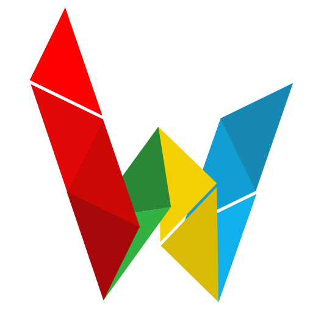

<p align="center">
  <a href="https://drash.io">
    
  </a>
  <h1 align="center">Sockets</h1>
</p>
<p align="center">A WebSocket library for <a href="https://github.com/denoland/deno">Deno</a>.</p>
<p align="center">
  <a href="https://github.com/drashland/socketse/releases">
    
  </a>
  <a href="https://github.com/drashland/sockets/actions">
    
  </a>
  <a href="https://discord.gg/SgejNXq">
    
  </a>
  <a href="https://twitter.com/drash_land">
    
  </a>
</p>

---

**_Although Sockets has working code, it is still very much under development and unstable. APIs will change without notice. Sorry for any inconvenience!_**

## Table of Contents
- [Getting Started](#getting-started)
- [Integrating](#integrating)
- Documentation (in progress)
- [Features](#features)
- [Roadmap](#roadmap)
- [Contributing](#contributing)
- [License](#license)

## Getting Started

To get you started as quickly as possible with a simple client and server, check out the following example app:

* [Browser Console](./example_apps/browser_console)

We also have a more advanced example app:

* [Chat](./example_apps/chat)

All example apps in the `example_apps` directory have their own `README.md` file. The `README.md` files have all the instructions you need to get started.

## Integrating

Sockets is composed of two parts:

* A `SocketServer` class that is used to instantiate a socket server on the back-end

    ```typescript
    import { SocketServer } from "https://deno.land/x/sockets@master/mod.ts";
    ```

* A client library that loads on the front-end

    ```html
    <script type="module" src="https://cdn.jsdelivr.net/gh/drashland/sockets-client@latest/client.js">
    ```

## Features

- Binary-support
- Auto-reconnection support

## Roadmap

- [ ] Docs website

## Contributing

Contributors are welcomed!

Please read through our [contributing guidelines](./.github/CONTRIBUTING.md). Included are directions for opening issues, coding standards, and notes on development.

## License

By contributing your code, you agree to license your contribution under the [MIT License](./LICENSE).
