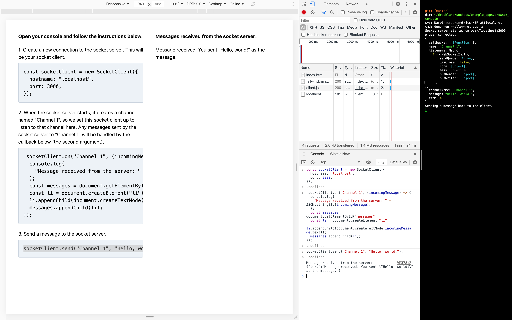

# Browser Console

This is an interactive client-server application where you send messages to the server using your browser's console and receive messages from the server (displayed in the DOM).

1. Clone the repo and go into the `browser_console` directory.

    ```
    $ git clone https://github.com/drashland/sockets.git
    $ cd sockets/example_apps/browser_console
    ```

2. Start the server.

    ```
    $ deno run --allow-net app.ts
    ```

3. Open `index.html` and follow the instructions on the screen.

Your experience should be something similar to the following:


