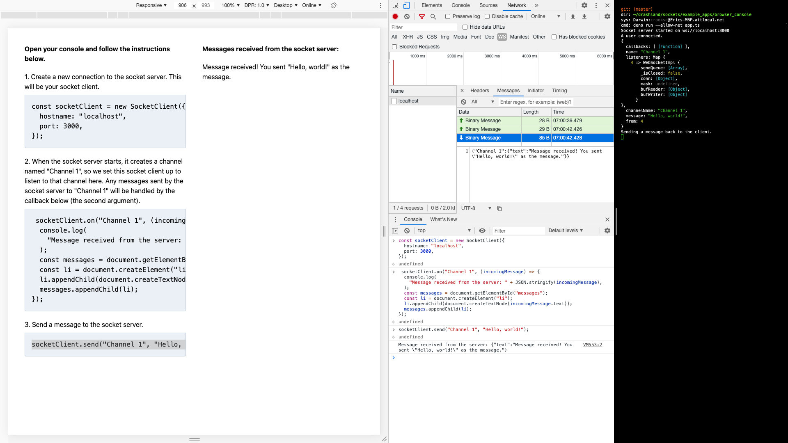

# Browser Console

This is an interactive application where you send messages to the socket server using your browser's console and receive messages from the socket server. Messages received from the socket server will be displayed in the DOM.

1. Create your `app.ts` file.

    ```typescript
    import { SocketServer } from "https://deno.land/x/sockets/mod.ts";

    // Create the socket server
    const socketServer = new SocketServer();
    socketServer.runTLS({
      hostname: "localhost",
      port: 3000,
      certFile: "/path/to/file.crt",
      keyFile: "/path/to/file.key",
    });
    console.log(
      `Socket server started on wss://${socketServer.hostname}:${socketServer.port}`,
    );

    // Listen for connections to the socket server
    socketServer.on("connection", () => {
      console.log("A user connected.");
    });

    // Listen for disconnections from the socket server
    socketServer.on("disconnect", () => {
      console.log("A user disconnected.");
    });

    // Create "Channel 1" so that clients can send messages to it
    socketServer
      .createChannel("Channel 1")
      .onMessage((packet: any) => {
        console.log(packet);
        console.log("Sending a message back to the client.");
        // Send messages to all clients listening to "Channel 1"
        socketServer.to(
          "Channel 1",
          `Message received! You sent "${packet.message}" as the message.`,
        );
      });
    ```

2. Start your server.

    ```
    $ deno run --allow-net app.ts
    ```

3. Create your `index.html` file. This file contains `<script src="https://cdn.jsdelivr.net/gh/drashland/sockets@master/client.js"></script>`, which is Sockets' `SocketClient` class.

    ```html
    <!DOCTYPE html>
    <html>
      <head>
        <title>Drashland / Sockets</title>
        <link rel="stylesheet" href="https://cdn.jsdelivr.net/npm/tailwindcss/dist/tailwind.min.css"/>
      </head>
      <body class="p-5">
        <div class="flex">
          <div class="w-1/2 p-5">
            <p class="mb-5">
              <strong>Open your console and follow the instructions below.</strong>
            </p>
            <p class="mb-2">1. Create a new connection to the socket server. This will be your socket client.</p>
            <pre class="mb-5 border-t border-r border-b border-l border-gray-400 rounded-b p-4 overflow-auto bg-gray-200">
                <code>
                  import('https://cdn.jsdelivr.net/gh/drashland/sockets@master/client.js').then(({default: SocketClient}) => {
                      const socketClient = new SocketClient({
                          hostname: "localhost",
                          port: 3000,
                          protocol: "wss"
                      });
                  });
                </code>
            </pre>
            <p class="mb-2">
              2. When the socket server starts, it creates a channel named "Channel 1", so we set this socket client up to listen to that channel here. Any messages sent by the socket server to "Channel 1" will be handled by the
              callback below (the second argument).
            </p>
            <pre class="mb-5 border-t border-r border-b border-l border-gray-400 rounded-b p-4 overflow-auto bg-gray-200">
              <code>
                import('https://cdn.jsdelivr.net/gh/drashland/sockets@master/client.js').then(({default: SocketClient}) => {
                    const socketClient = new SocketClient({
                        hostname: "localhost",
                        port: 3000,
                        protocol: "wss"
                    });

                    socketClient.on("Channel 1", (incomingMessage) => {
                        console.log(
                            "Message received from the server: " + JSON.stringify(incomingMessage),
                        );
                        const messages = document.getElementById("messages");
                        const li = document.createElement("li");
                        li.appendChild(document.createTextNode(incomingMessage.text));
                        messages.appendChild(li);
                    });
                });
              </code>
            </pre>
            <p class="mb-2">3. Send a message to the socket server.</p>
            <pre class="mb-5 border-t border-r border-b border-l border-gray-400 rounded-b p-4 overflow-auto bg-gray-200">
              <code>
                import('https://cdn.jsdelivr.net/gh/drashland/sockets@master/client.js').then(({default: SocketClient}) => {
                    const socketClient = new SocketClient({
                        hostname: "localhost",
                        port: 3000,
                        protocol: "wss"
                    });

                    socketClient.on("Channel 1", (incomingMessage) => {
                        console.log(
                            "Message received from the server: " + JSON.stringify(incomingMessage),
                        );
                        const messages = document.getElementById("messages");
                        const li = document.createElement("li");
                        li.appendChild(document.createTextNode(incomingMessage.text));
                        messages.appendChild(li);
                    });

                    socketClient.to("Channel 1", "Hello, world!");
                });
              </code>
            </pre>
          </div>
          <div class="w-1/2 p-5">
            <p class="mb-5">
              <strong>Messages received from the socket server:</strong>
            </p>
            <ul id="messages"></ul>
          </div>
        </div>
      </body>
    </html>
    ```

4. Open up your `index.html` file and follow the instructions on the screen.

Your experience should be something similar to the following:


